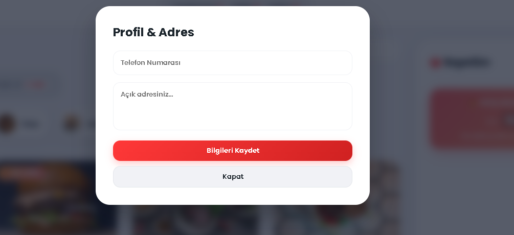
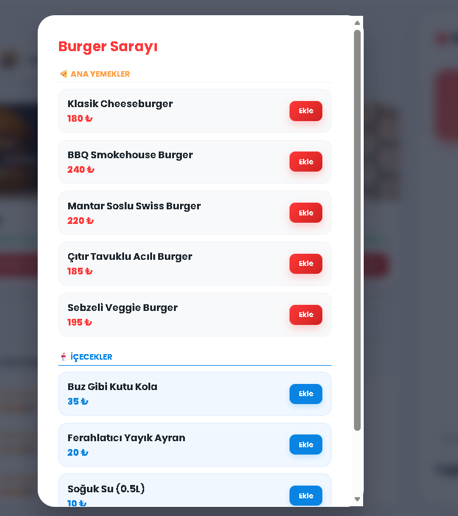
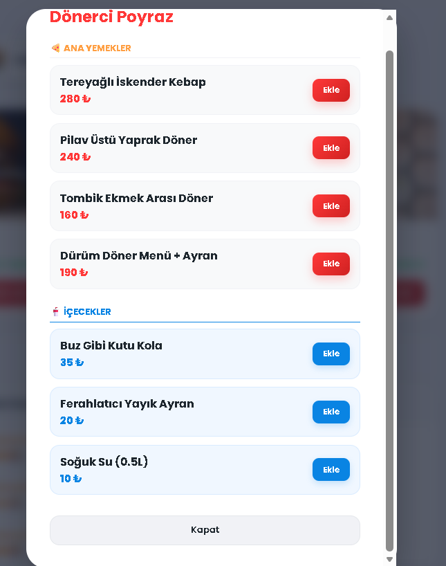
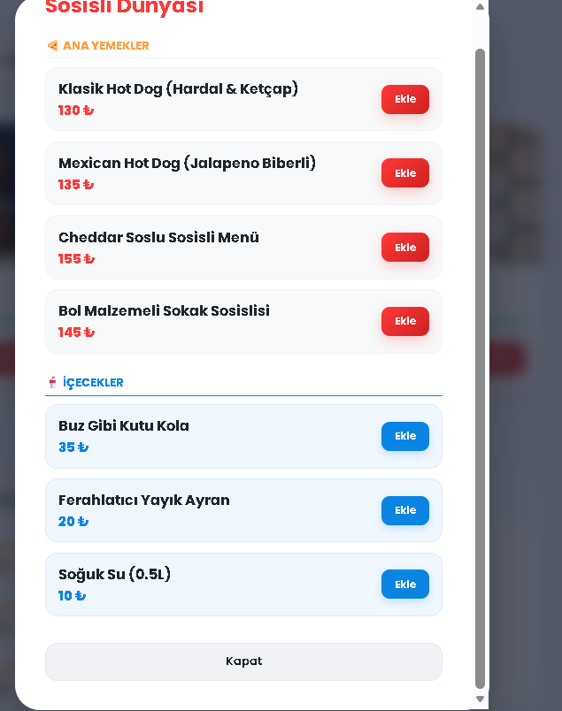
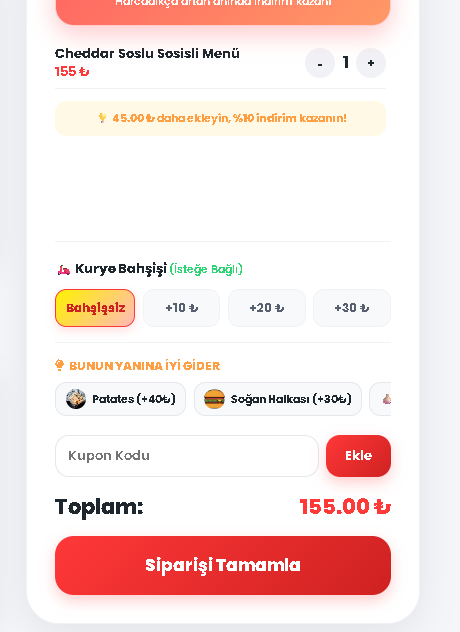
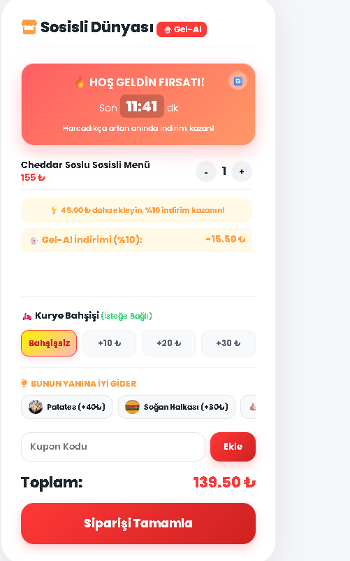

# 🍴 Lezzet Atlası | Online Sipariş & Restoran Yönetim Platformu

Lezzet Atlası, kullanıcıların hızlı ve kolay bir şekilde yemek siparişi verebildiği, ürün özelleştirmeleri yapabildiği ve siparişlerini canlı olarak takip edebildiği modern bir **ASP.NET Core Web API** ve **Vanilla JavaScript** projesidir.

Gelişmiş sepet algoritmaları, kurye bahşiş sistemi, Gel-Al indirimleri ve anlık (Flash) kampanyalar ile hem son kullanıcılara hem de restoran yöneticilerine kusursuz bir deneyim sunmayı hedefler.

---

## 📸 Uygulama Arayüzü & Operasyonel Kanıtlar (UI/UX)

Sistemin tüm modülleri asenkron API mimarisi ile uçtan uca test edilmiş ve aşağıdaki ekran görüntüleriyle kayıt altına alınmıştır:

### 👤 1. Kullanıcı & Oturum Yönetimi
- **Giriş ve Kayıt Paneli:**  | 
- **Kullanıcı Profil Ekranı:** 

### 🍕 2. Ürün Keşfi & Dinamik Menüler
- **Ana Sayfa & Restoran Arama:**  | 
- **Kategori Menüleri:**  |  |  | 
- **Ürün Özelleştirme (Pişme Derecesi & Malzeme Seçimi):** 

### 🛒 3. Gelişmiş Sepet & İndirim Motoru
- **Zamanlayıcılı Flash İndirim Kampanyaları:** 
- **Kupon ve Kampanya Ekranı:** 
- **Sepet Özeti (Normal):** 
- **Kupon ve Gel-Al Entegrasyonlu Sepetler:**  | 
- **Sepet Çakışma Kontrolü (Farklı Restoran Doğrulaması):** 

### 🚀 4. Canlı Sipariş Takibi & Fatura
- **Sipariş Durumu:**  | **Sipariş İptali:** 
- **Detaylı Dijital Fatura:** 

### ⚙️ 5. Admin / Restoran Yönetim Paneli
- **Sipariş Aşamaları Yönetimi:** 
- **Restoran ve Menü Kontrolü:** 

---

## ✨ Öne Çıkan Özellikler

### 🔒 Kimlik Doğrulama (Auth)
- **JWT Güvenliği:** Güvenli uç noktalar, oturum ve token yönetimi.
- **Dinamik Formlar:** Tek ekranda pürüzsüz geçişler ve LocalStorage tabanlı oturum kontrolü.

### 🧠 Akıllı Sepet Algoritmaları
- **Çapraz Satış (Cross-Sell):** Sepete eklenen ürüne göre *"Bunun yanına iyi gider"* tavsiyeleri.
- **Esnek Teslimat:** Adrese teslimde bahşiş entegrasyonu, Gel-Al siparişlerinde anında **%10 ekstra indirim**.

---

## 🛠️ Kullanılan Teknolojiler

### Backend
- **Framework:** ASP.NET Core Web API (.NET 6 / 8)
- **ORM & DB:** Entity Framework Core, SQLite / SQL Server
- **Güvenlik:** JWT (JSON Web Tokens), Role-based Authorization (`admin` & `user`)

### Frontend
- **Tasarım:** Modern Flexbox/Grid mimarisi, CSS Değişkenleri, Tam Duyarlı (Responsive) Tasarım.
- **Mantık Katmanı:** Vanilla JavaScript (ES6+), Asenkron Fetch API, DOM Manipülasyonu.

---

## 🚀 Kurulum & Çalıştırma

### 1. Backend (API) Kurulumu
1. Projeyi Visual Studio ile açın.
2. Paket Yöneticisi Konsolu üzerinden veritabanını oluşturun:
   ```bash
   Update-Database
