# 🍴 Lezzet Atlası | Online Sipariş & Restoran Yönetim Platformu

Lezzet Atlası; kullanıcıların hızlı yemek siparişi verebildiği, adminlerin ise tüm operasyonu anlık yönetebildiği **ASP.NET Core Web API** ve **Vanilla JavaScript** tabanlı tam kapsamlı bir platformdur.

---

## 📸 Uygulama Arayüzü & Operasyonel Kanıtlar

Aşağıdaki görseller, sistemin tüm modüllerinin asenkron API mimarisi ile nasıl çalıştığını adım adım göstermektedir.

### 👤 1. Kullanıcı Giriş ve Kayıt Paneli
Sistem, JWT tabanlı güvenli oturum yönetimi kullanmaktadır.

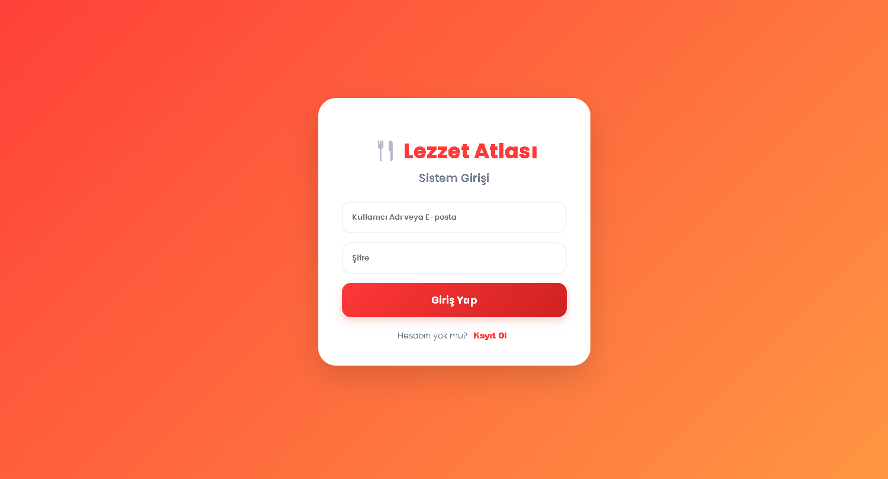

 

 

### 🏠 2. Ana Sayfa ve Restoran Keşfi
Kullanıcıların restoranları listeleyebildiği ve arama yapabildiği ana ekran.

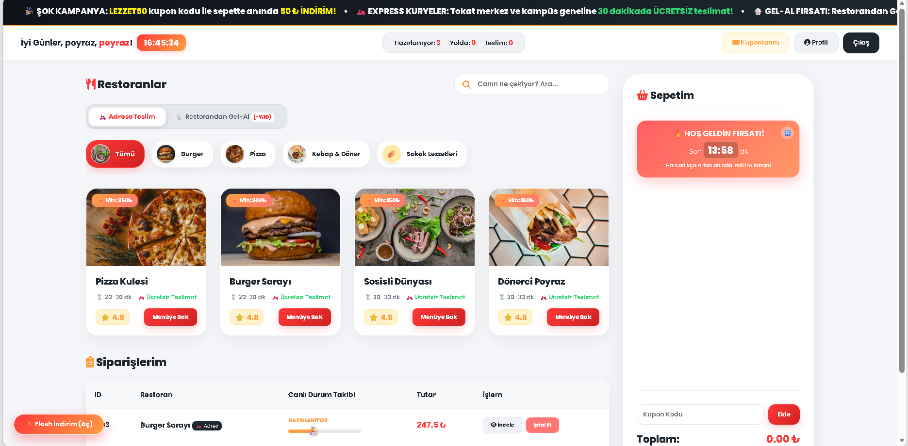

 

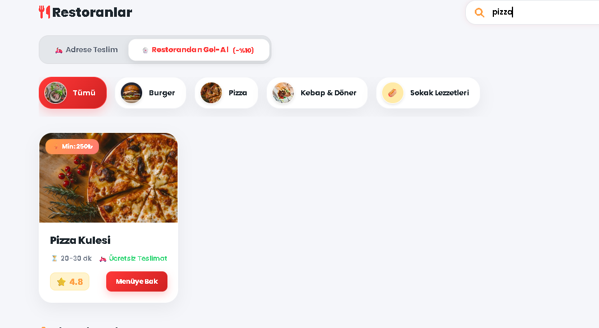

 

### 🍕 3. Menü ve Ürün Detayları
Kategori bazlı menüler ve ürün özelleştirme (malzeme seçimi) ekranları.

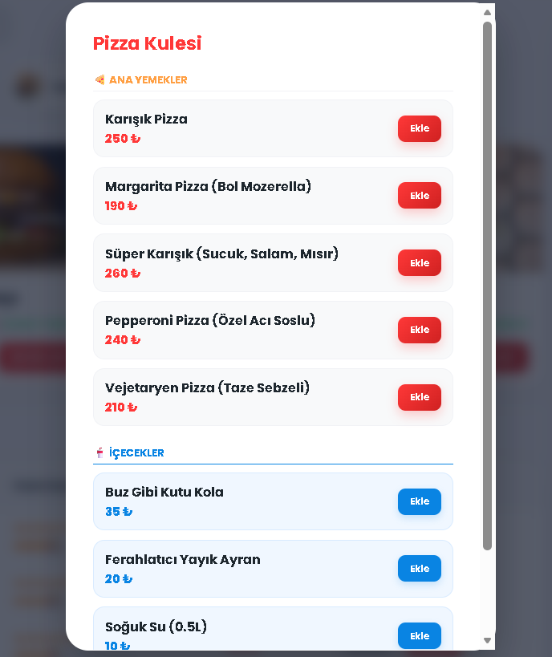

 

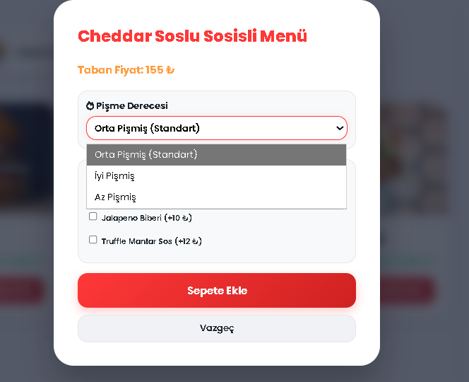

 

### 🛒 4. Gelişmiş Sepet ve İndirim Yönetimi
Gel-Al indirimleri, kuponlar ve flash kampanyaların uygulandığı sepet modülü.

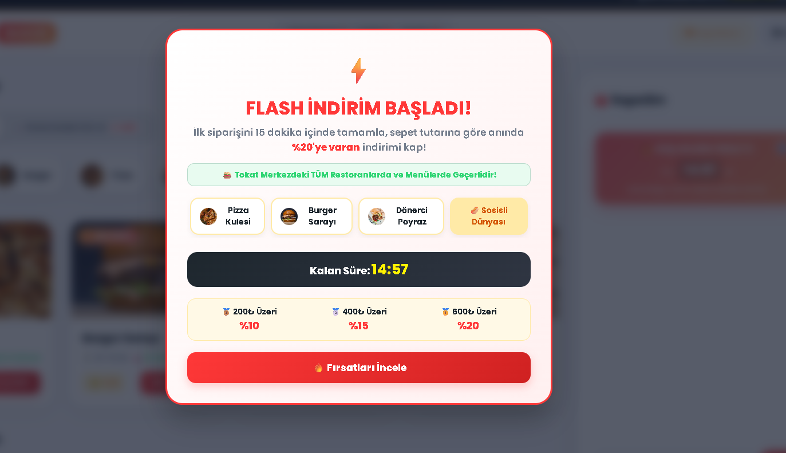

 

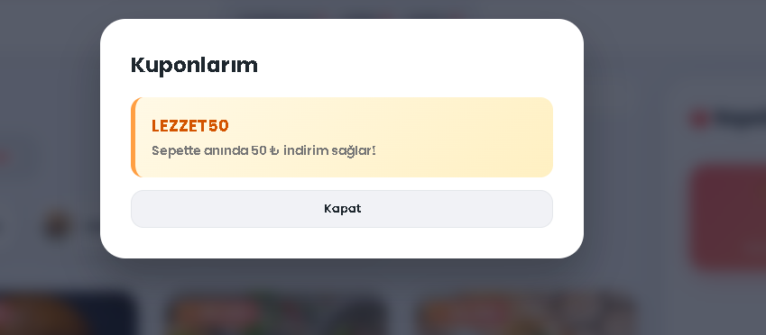

 

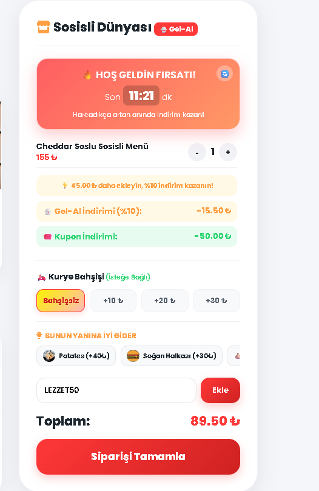

 

### 🛵 5. Canlı Sipariş Takibi ve Fatura
Siparişin mutfaktan teslimata kadar olan süreci ve final fatura dökümü.

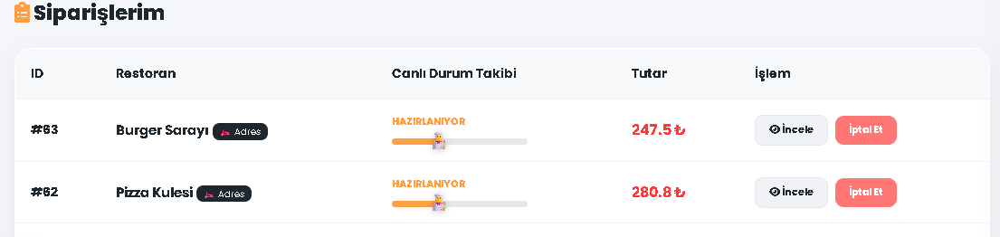

 

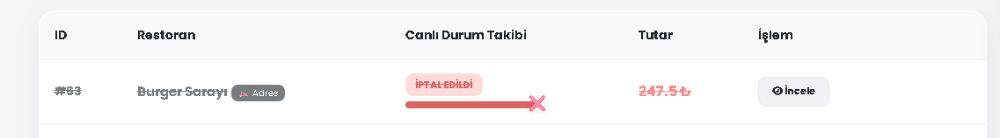

 

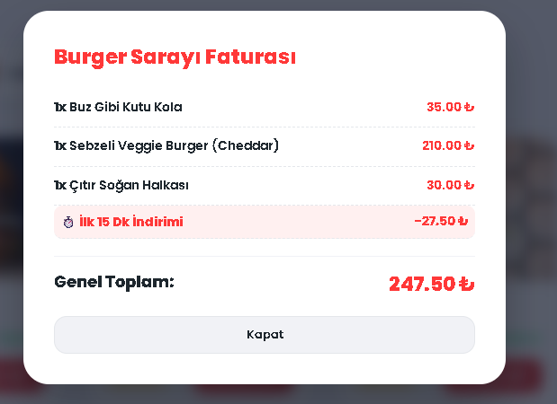

 

### ⚙️ 6. Yönetim (Admin) Panelleri
Siparişlerin onaylandığı ve restoran/menü ayarlarının yapıldığı yetkili panelleri.

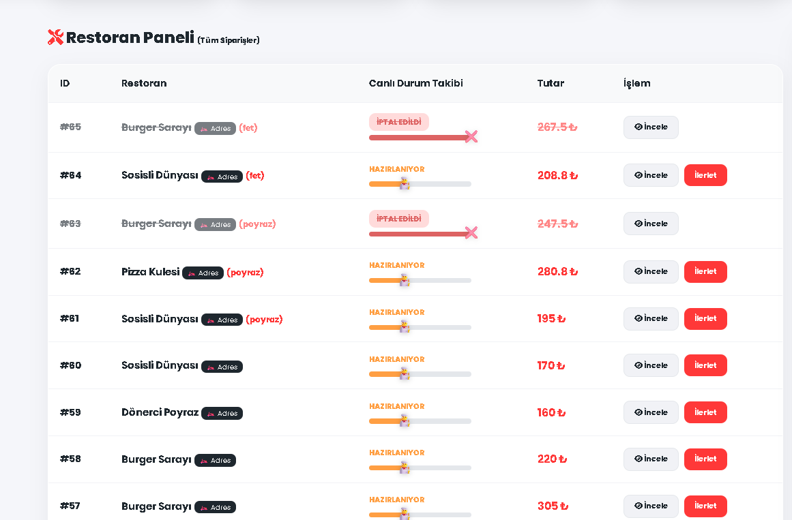

 

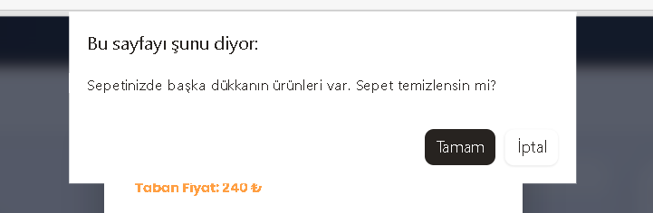

---

## 🛠️ Teknik Yetkinlikler

- **Backend:** ASP.NET Core Web API (.NET 8), Entity Framework Core, JWT Auth.
- **Frontend:** Vanilla JavaScript (ES6+), Modern CSS (Flexbox/Grid), Fetch API.
- **Veritabanı:** SQLite / SQL Server.

---

> **Geliştirici:** Poyraz Kesgin  
> **Durum:** Tüm modüller entegre edildi ve başarıyla test edildi.
